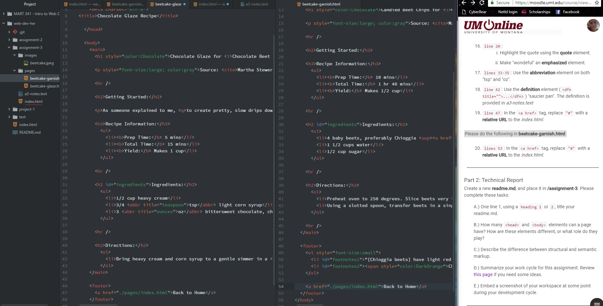

# Assigment 3
## Technical Report

---

A. There is one head and one body element, but countless other elements can be written into them. The head contains the information that is important, such as the language and author, but is invisible to the person browsing. The body holds the "meat and potatoes," or all the visible elements of the web page like text, images, etc.

B. Stuctural markup is what creates the formatting like headings, paragraphs, and lists. Semantic markup is what visually shows the meaning of text, such as bold or italics.

C. Work Cycle
- It took a lot of focus to complete this assignment. There were a lot more details than last week to keep track of. I struggle the most with remembering to add the ending element of a pair, and have to go back and find where the mistake came from.
- I found it very interesting to work within existing written html so I could see certain elements in more detail even if it wasn't specifically worked with.
- I also find it hard to switch back to markup at the end of the day. I always have to go back and refresh.

