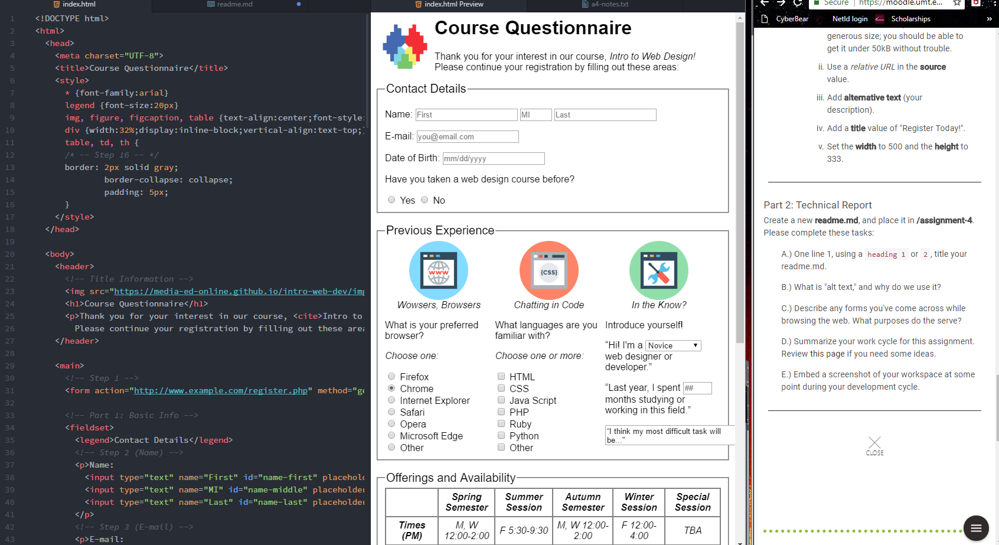

# Assignment 4 Techical Report

Alternate text is used to describe the element inserted into the page. If for some reason an image or element doesn't load, the alt text will led the viewer know what is supposed to be there.

I come across forms all the time. Logins, payment checkouts, subscriptions, all over the place. They let you into secure sites, let you buy things, etc.

Honestly, the toughest thing for me this time was remembering to use the end tags. After the longer chunks of code for the forms, I kept forgetting the tag and the program kept getting angry at me.

