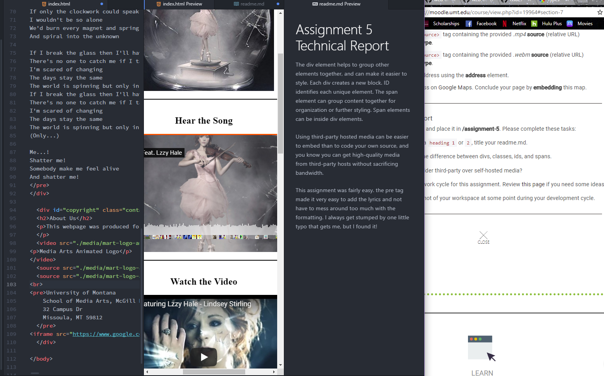

# Assignment 5 Technical Report

The div element helps to group other elements together, and can make it easier to style. Each div creates a new block. ID identifies each unique element. The span element can group content together for organization or further styling. Span elements can be inside div elements.

Using third-party hosted media can be easier to embed than to code your own source, and you know you can get high-quality media from third-party hosts without sacrificing bandwidth.

 This assignment was fairly easy. the pre tag made it very easy to add the lyrics and not have to mess around too much with the formatting. I always get stumped by one little typo that gets me, but I found it!

 
