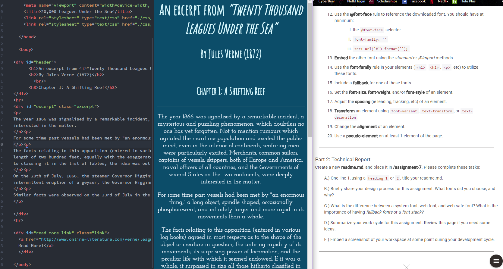

# Assignment 7 Technical Report

Since I chose to use the excerpt from "20,000 Leagues Under the Sea," I knew I wanted to go with colors that represent the ocean. I picked a dark blue and a bluish white to contrast each other, and also white. I think it looks pretty nautical! I feel like my header font fits with the theme, and my text font I really like. It has an old vibe to it that fits the old story, but not too much that it looks like a standard old font.

System fonts live on your computer and you already have access to use them, but they might not be accessible to everyone else. Web fonts live online, like Google Fonts, and are designed to work with the web. It is important to have one or more fallback fonts so that just in case someone else's system can't load a particular font, there is a backup font to take its place and keep your web page intact.

I thought this one was pretty fun. It's still tough for me to get the hang of CSS files, but I'm getting better. It was fun picking out contrasting colors.

