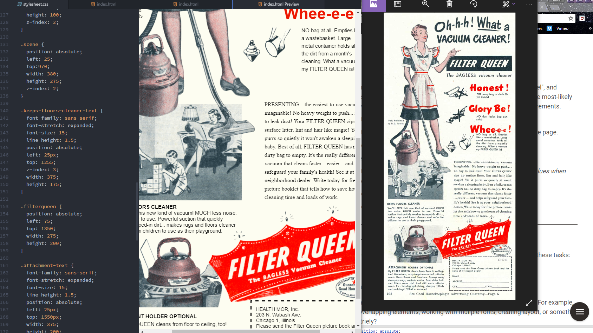

# Assignment 8 Technical Report

Padding is the gap between the contents of an element and the edge of the inside of that element. Margin is the space between the element and other elements. Borders are the outer edges of an element.

The hardest part of this assignment was getting the right positioning for each of the elements. I had to keep adjusting and adjusting to get it right and match as close as I could to the original.

This assignment was a tough one for me. It took quite a while to get going. I still find CSS really confusing, but I was able to poke around through the lessons and figure it out, it just took quite a while to really get on a roll.

I was struggling with my CSS file not showing up on my preview. It took longer than I'd like, but I figured out you have to save it every time you change something for it to show up, which added some extra time when shuffling elements 5 or 10 pixels in a direction.

