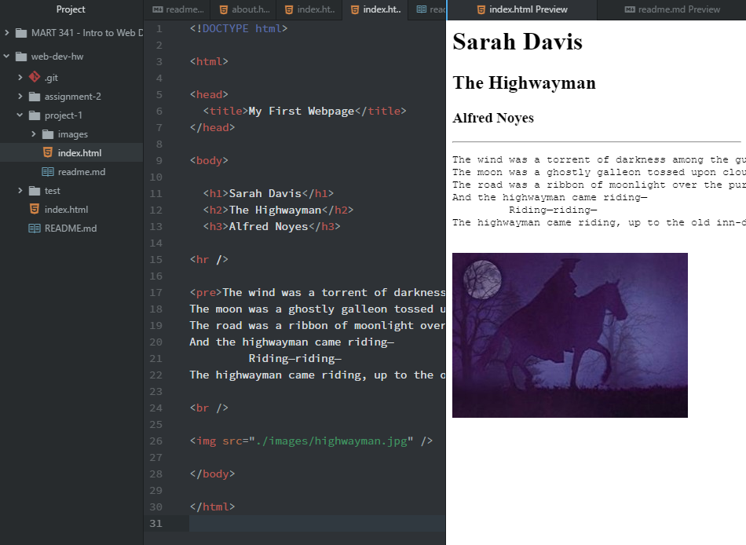

# Project 1
## Technical Report
---
- Google Chrome
- Safari
- Google Chrome (mobile)

A web browser, using a rendering engine, browser engine, and javascript interpreter, allows the user to interact with the interface and display the correct information and media on a webpage.

I thought the Wayback Machine was really cool. The URLs for social media platforms like Facebook and Myspace weren't even there yet in 2000. Both URLs led to entirely different pages, though the Facebook one had a similar concept, but was designed as a workplace phonebook.

I also looked at the umt.edu site. In 2000, the webpage was plain and to the point. Besides the UM logo at the top, there was only one (broken) image on the page. If you look at it now, it is covered in various images, links, and interactive media.

---
In this work cycle, the only thing I really struggled with was trying to remember the different HTML commands and how to start and end them properly. I had to repeatedly go back and refresh myself on how to accomplish each portion.

