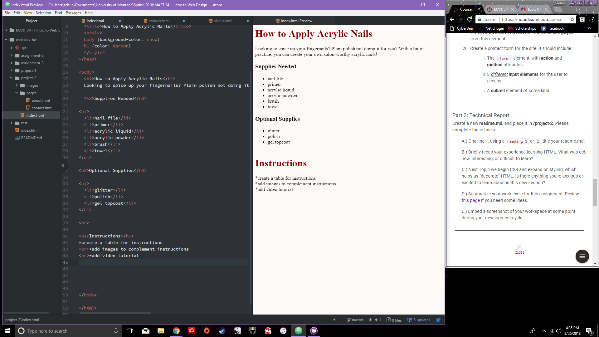

# Technical Report

I find this class very interesting, but I really struggled with creating the form in html. I plan on taking extra time this week to figure it out.

I am excited to learn how to add animations and more active, moving pieces.

I chose a subject that requires a bit more explanation than I initially thought, but it is something I find very interesting. For some reason, I can't get my images to work, even though I copied the exact thing to write. The table was really interesting to make, but it was very easy to get lost in the coding and completely mess it up!

